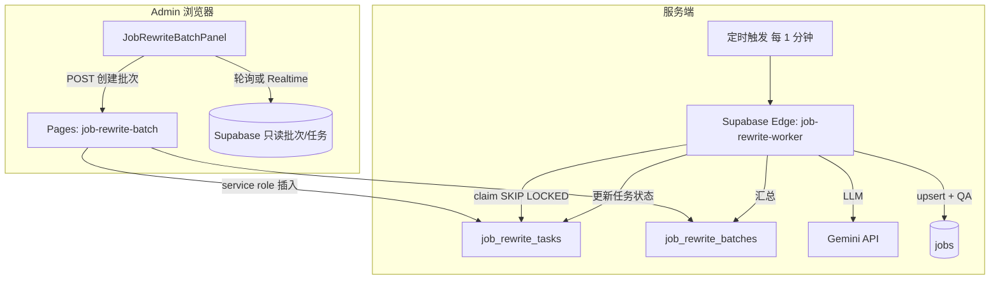

# AI 职位改写 — 异步队列方案（方案 A）设计说明

> 状态：**已选型，待评审后开发**  
> 替代目标：当前 Admin 浏览器内「逐条同步调用 Gemini + upsert」的 `JobRewriteUploadPanel` 实现。  
> 产品规范不变：`docs/job-content-rewrite-plan-zh.md`。

---

## 1. 目标与非目标

### 1.1 目标

| 目标 | 说明 |
|------|------|
| **可关页面** | 上传 CSV 后生成批次任务，改写由服务端执行 |
| **可续跑** | 每行独立状态；失败可重试，不必整批重跑 |
| **Key 安全** | `LLM_API_KEY` 仅存在于 **Supabase Edge Function / Pages Function** Secret，不再打进前端 bundle |
| **全局限流** | 统一 RPM、503/429 退避，降低 suspended 风险 |
| **大批量** | 支持 5000+ 行（分批 claim，数小时完成可接受） |

### 1.2 非目标（首版不做）

- 实时「上传后 30 秒内全部出现在列表」（接受分钟～小时级延迟）
- Gemini Batch API 离线提交（可作为 Phase 3 增强）
- 多 LLM 供应商自动切换（Phase 2 可预留 `provider` 字段）

---

## 2. 架构总览



**为何用 Supabase 队列表 + Edge Worker，而不是浏览器 runPool**

- 仓库已是 **Cloudflare Pages + Supabase**，无独立 `wrangler` Worker 项目；队列表 + `FOR UPDATE SKIP LOCKED` 与现有 WhatsApp Edge Functions 模式一致。
- 若未来要迁 **Cloudflare Queues**，只需把 Worker 从 Supabase Edge 换成 Queue Consumer，**表结构可保留**。

---

## 3. 数据模型

### 3.1 `job_rewrite_batches`

| 列 | 类型 | 说明 |
|----|------|------|
| `id` | `uuid` PK | 批次 ID |
| `created_at` | `timestamptz` | |
| `created_by` | `uuid` | `auth.users.id`（Admin 登录用户） |
| `status` | `text` | `queued` \| `running` \| `completed` \| `cancelled` \| `failed` |
| `total_count` | `int` | 任务行数 |
| `pending_count` | `int` | 冗余计数，便于 UI |
| `saved_count` | `int` | 成功写入 `jobs` |
| `failed_count` | `int` | |
| `source_filename` | `text` | 可选，原始 CSV 名 |
| `llm_model` | `text` | 创建时快照，如 `gemini-2.0-flash` |
| `error_summary` | `text` | 批次级错误摘要 |

### 3.2 `job_rewrite_tasks`

| 列 | 类型 | 说明 |
|----|------|------|
| `id` | `uuid` PK | |
| `batch_id` | `uuid` FK | |
| `row_index` | `int` | CSV 行序 |
| `job_id` | `text` | 目标 `jobs.id` |
| `status` | `text` | `pending` \| `processing` \| `done` \| `failed` \| `skipped` |
| `input` | `jsonb` | `JobRewriteInput`（与现 `buildJobRewriteInputFromRow` 一致） |
| `row_snapshot` | `jsonb` | 合并后的 CSV 行，供 `buildJobUpsertAfterRewrite` |
| `result` | `jsonb` | 成功时 LLM 输出 + QA |
| `error` | `text` | 失败原因（截断 500 字） |
| `attempts` | `smallint` | 默认 0，最大 6 |
| `locked_at` | `timestamptz` | claim 时间，超时释放 |
| `locked_by` | `text` | worker 实例 id |
| `updated_at` | `timestamptz` | |

**索引**

- `(batch_id, status, row_index)` — Worker claim
- `(status, locked_at)` — 超时回收 `processing`

### 3.3 RLS

| 角色 | `batches` | `tasks` |
|------|-----------|---------|
| `authenticated`（Admin） | `SELECT` 自己的 + `INSERT` 创建批次 | `SELECT` 属于自己批次 |
| `service_role`（Edge Worker） | `UPDATE` 计数与状态 | `INSERT/UPDATE` 全部 |

**禁止** anon 访问。创建批次走 **Pages Function 校验 session**，用 service role 批量 `insert tasks`。

---

## 4. API 与函数边界

### 4.1 `POST /job-rewrite-batch`（Cloudflare Pages Function）

**职责**：鉴权、解析 CSV（或接收已解析 JSON）、创建 batch + tasks。

请求（二选一）：

- `multipart/form-data`：`file` = CSV（与现 Panel 相同解析逻辑，可抽到 shared 包或 duplicate 最小子集）
- `application/json`：`{ "rows": [...], "filename": "..." }`（Admin 先 Papa 解析再 POST，减轻 Function CPU）

响应：

```json
{ "success": true, "batch_id": "uuid", "total": 5000 }
```

**不在此函数内调用 Gemini**。

### 4.2 `GET /job-rewrite-batch?id=`（Pages Function 或 Supabase RPC）

返回批次汇总 + 最近 20 条失败任务（供 UI）。

### 4.3 `POST /job-rewrite-batch/cancel?id=`（可选 Phase 1.1）

将 `pending` 标为 `skipped`，`running` 等当前条完成后停。

### 4.4 Supabase Edge：`job-rewrite-worker`

**触发**：Supabase Dashboard Cron **每 1 分钟**（或 `pg_cron`）。

**单次运行逻辑**（伪代码）：

1. `claim` 最多 `N` 条 `pending`（`N` = 环境变量，默认 **4**，硬顶 8）
2. 对每条：调用 Gemini（复用 `functions/job-rewrite.ts` 内逻辑，或 Deno 版抽共享 prompt）
3. QA 通过 → `buildJobUpsertAfterRewrite` 等价逻辑 → `upsert jobs`（`is_active=true`，`clampJobRewriteTitle`）
4. 更新 task → `done` / `failed`；`attempts++`；503/429 → 保持 `pending` 并写 `error`，退避后重试
5. 回收 `processing` 且 `locked_at < now() - 15min` → `pending`
6. 更新 batch 计数；若 `pending=0` 且无非 processing → `completed`

**Secrets（仅 Edge）**：`LLM_API_KEY`、`LLM_BASE_URL`、`LLM_MODEL`、`SUPABASE_SERVICE_ROLE_KEY`。

### 4.5 废弃路径（迁移完成后删除）

- 浏览器 `rewriteJobContentViaClient` / `vite.config` 注入 `LLM_API_KEY`
- Admin 内 `runPool` + 同步 `rewriteJobContentWithRetry`
- 保留 `GET/POST /job-rewrite` 仅供 Worker 内部复用，或合并进 Edge Worker

---

## 5. Admin 产品行为

### 5.1 新 UI：`JobRewriteBatchPanel`（替换现 `JobRewriteUploadPanel`）

1. **上传 CSV** → 显示「已创建批次 #xxxx，共 N 条」
2. **进度条**：`saved / failed / pending`，估计剩余时间（按最近 5 分钟吞吐）
3. **表格**：可选展开失败行（job_id + error）
4. **按钮**：「刷新状态」「取消剩余」「下载失败 CSV」（Phase 1.1）
5. **文案**：明确「可关闭本页，任务在服务端继续」

### 5.2 状态同步

- **首选**：Supabase Realtime `job_rewrite_batches` + `tasks`（仅当前 batch_id filter）
- **兜底**：每 5s `GET` 轮询（Realtime 未开时）

---

## 6. 限流与可靠性（防封）

| 参数 | 默认值 | 说明 |
|------|--------|------|
| `JOB_REWRITE_WORKER_CLAIM_SIZE` | 4 | 每次 Cron 最多处理条数 |
| `JOB_REWRITE_MIN_DELAY_MS` | 300 | 条与条之间 sleep |
| `JOB_REWRITE_MAX_ATTEMPTS` | 6 | 单 task 最大尝试 |
| `JOB_REWRITE_LOCK_TIMEOUT_MIN` | 15 | processing 超时回 pending |
| Cron 周期 | 1 min | 可调到 30s（稳定后） |

503/429：**不**换浏览器第二通道；仅增加 `attempts` + 指数退避。

---

## 7. 代码复用与目录

| 现有 | 迁移方式 |
|------|----------|
| `jobContentRewritePrompt.ts` | 作为唯一 Prompt 源；`functions/job-rewrite.ts` 改为构建时复制或 import map（若 Pages 不能 import `src/`，保留 Deno 副本 + CI 校验一致） |
| `jobContentRewriteBuild/Apply/Qa/Split` | Worker 侧 Deno 端口或 HTTP 调 Pages `/job-rewrite` 仅做 LLM（不推荐循环 HTTP） |
| `prepareRowForRewriteImport` | Admin 或 `POST /job-rewrite-batch` 共用 |
| `jobRewriteTitle.ts` | Worker upsert 前必调 |

**推荐**：`supabase/functions/job-rewrite-worker/index.ts` 内联最小 LLM+QA+upsert（与现 `functions/job-rewrite.ts` 同步片段），避免跨 runtime import `src/`。

---

## 8. 分阶段交付

### Phase 1（MVP，约 1 周）

- [ ] migration：`batches` + `tasks` + RLS
- [ ] `POST /job-rewrite-batch` + Admin 创建批次
- [ ] Edge `job-rewrite-worker` + Cron
- [ ] Admin 进度 UI（轮询即可）
- [ ] 文档：Cloudflare **不再**配置构建时 `LLM_API_KEY`

### Phase 1.1

- [ ] 取消批次、失败 CSV 导出、单 task 重试
- [ ] Realtime 进度

### Phase 2

- [ ] 规则化「快路径」（方案 D）：模板拼 Detalles，LLM 只写 Resumen+列表
- [ ] 监控：批次耗时、失败率、503 计数

### Phase 3（可选）

- [ ] Gemini Batch API 夜间回填
- [ ] Cloudflare Queue 替代 Cron（吞吐更高时）

---

## 9. 环境变量（Staging / Production）

| 变量 | 位置 | 说明 |
|------|------|------|
| `LLM_API_KEY` | Supabase Edge Secrets **only** | 禁止 Vite 构建注入 |
| `LLM_BASE_URL` | 同上 | |
| `LLM_MODEL` | 同上 | 建议 `gemini-2.0-flash` |
| `SUPABASE_SERVICE_ROLE_KEY` | Edge 自动注入 | Worker upsert |
| `JOB_REWRITE_WORKER_CLAIM_SIZE` | Edge | 可选 |

Admin 构建变量保留：`VITE_JOB_REWRITE_MAX_ROWS`（单次上传行数上限）。

---

## 10. 风险与对策

| 风险 | 对策 |
|------|------|
| Edge Function 单次执行超时 | `CLAIM_SIZE` 小（4）；1 分钟 Cron 多次接力 |
| Supabase Edge 与 Pages 重复逻辑 | Phase 1 接受少量 duplicate；加脚本 diff prompt |
| 用户上传极大 CSV | 创建批次时 server 端 `slice(0, maxRows)` |
| Worker 宕机留锁 | `LOCK_TIMEOUT` 回收 processing |

---

## 11. 验收标准

1. 上传 100 行 CSV → 关闭 Admin 标签 → 30 分钟内 `saved_count` 持续增长直至完成  
2. 故意断网 / 关页不影响任务（仅 UI 不更新）  
3. 构建产物中 **无** `LLM_API_KEY` 字符串（`rg` 检查 `dist/`）  
4. 失败行可在 UI 看到 `job_id` + 错误；重试后 `saved_count` 增加  
5. 改写后 `/empleos` 可见且标题 ≤ 48 字符（现有 clamp 保留）

---

## 12. 评审确认项

请确认后进入开发（`writing-plans` / 分 PR）：

1. Worker 放在 **Supabase Edge Cron**（本文默认）是否 OK？还是必须 **Cloudflare Queue**？  
2. CSV 解析放在 **浏览器 POST JSON**（减轻 Function）还是 **Function 收文件**？  
3. Phase 1 是否 **直接下线** 同步改写按钮，还是并行保留 2 周？

---

*文档版本：2026-05-15 · 方案 A 用户已确认选型*

---

## 13. Phase 1 部署清单（Staging）

1. **数据库**：在 Staging Supabase SQL Editor 执行 `supabase/migrations/20260519120000_job_rewrite_queue.sql`（或 `supabase db push`）。
2. **Edge Function**：部署 `job-rewrite-worker`（`supabase functions deploy job-rewrite-worker`）。
3. **Secrets**（Supabase → Project Settings → Edge Functions → Secrets）：
   - `LLM_API_KEY`
   - `LLM_BASE_URL` = `https://generativelanguage.googleapis.com/v1beta`
   - `LLM_MODEL` = `gemini-2.0-flash`（推荐）
   - 可选：`JOB_REWRITE_WORKER_CLAIM_SIZE=4`、`JOB_REWRITE_MIN_DELAY_MS=300`
4. **Cron**：确认 `supabase/functions/job-rewrite-worker/config.toml` 中 `[schedule] cron = "* * * * *"` 已随部署生效。
5. **前端**：部署最新 `staging` 分支；Admin 使用「上传 CSV（后台改写）」。
6. **勿**再在 Cloudflare 构建变量里注入 `LLM_API_KEY`（避免打进浏览器包）。

验收：上传 3 条测试 CSV → 关闭 Admin → 几分钟后 `saved_count=3`，`/empleos` 可见。
