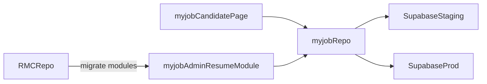

# RMC 并入 myjob 迁移方案（可逆、分阶段）

目标：把 `RMC` 仓库能力收敛到 `myjob` 仓库，减少多仓维护成本，同时不影响线上可用性。

当前原则：
- 先“并开发入口”，再“并部署入口”。
- 每一步可回滚。
- 不在同一批次同时改数据库结构与前端路由切流。

## 1. 当前基线（2026-05-09）

## 1.1 myjob 已具备的 RMC 相关能力

- 已有候选人查询页：`src/pages/CandidateSearch.tsx`
- 已有外部简历库适配：`src/integrations/resumes/client.ts`
- 已有 RMC 相关 webhook 处理：`supabase/functions/whatsapp-webhook/rmc.ts`

## 1.2 RMC 仓库核心模块（外部仓库盘点）

- 前端页面：
  - `src/pages/Resumes.tsx`
  - `src/pages/ResumeDetail.tsx`
  - `src/pages/Import.tsx`
- API 与解析：
  - `api/routes/resumes.ts`
  - `api/resumeParser.ts`
- Pages Functions：
  - `functions/proxy.ts`
  - `functions/ai-extract.ts`
- Supabase 迁移：
  - `supabase/migrations/0001~0009`

## 2. 目标并入架构

并入后职责：
- 用户侧候选人浏览继续由 `myjob` 主站提供
- RMC 的“导入/解析/详情编辑”作为 `myjob` 内部模块（建议挂在 `/admin/resumes`）
- 部署由 `myjob` 统一管理，`RMC` 仓库停止日常开发

## 3. 路径映射（外部 RMC -> myjob）

| RMC 路径 | 并入到 myjob 路径 | 处理方式 |
|---|---|---|
| `src/pages/Resumes.tsx` | `src/pages/admin/resumes/ResumesPage.tsx` | 保留能力，改路由与 UI 壳 |
| `src/pages/ResumeDetail.tsx` | `src/pages/admin/resumes/ResumeDetailPage.tsx` | 保留能力，适配 myjob 组件 |
| `src/pages/Import.tsx` | `src/pages/admin/resumes/ImportPage.tsx` | 保留导入流程 |
| `src/lib/resumeParserClient.ts` | `src/lib/resumes/resumeParserClient.ts` | 迁移并去重 |
| `api/resumeParser.ts` | `src/server/resumes/resumeParser.ts`（或 Supabase Function） | 先保持兼容接口 |
| `functions/proxy.ts` | `functions/proxy.ts`（myjob） | 合并并复用 |
| `functions/ai-extract.ts` | `functions/ai-extract.ts`（myjob） | 合并并复用 |
| `supabase/migrations/0001~0009` | `supabase/migrations/2026xxxx_rmc_*.sql` | 重编号后按环境推进 |

## 4. 分阶段执行（建议）

## Phase 0：冻结与对齐（当天）

- 冻结 `RMC` 新功能开发（只允许 bugfix）
- 固定“主开发入口 = myjob”
- 在 `docs/ops/platform-inventory-zh.md` 标记 `RMC` 为“待归档”

## Phase 1：代码并入（不切流）

- 在 `myjob` 增加 `admin/resumes` 模块目录
- 先迁 `UI + 数据读取`，不迁部署入口
- 新增 feature flag：`VITE_ENABLE_RESUME_ADMIN`

回滚点：
- 关闭 feature flag 即可隐藏新模块，不影响现有链路

## Phase 2：数据与接口统一

- 把 RMC 迁移脚本重编号并并入 `myjob/supabase/migrations`
- 在 staging 执行并验证，再到 prod
- 对齐 `public_candidates` 视图字段，保证 `CandidateSearch` 不中断

回滚点：
- 数据结构保持向后兼容，保留旧视图或建立兼容 view

## Phase 3：部署入口收敛

- 将 RMC 的 Pages Functions 能力并入 `myjob` 部署工程
- `myjob` 项目承担 RMC 功能访问路径
- 观察期通过后，`RMC` 项目转只读/归档

回滚点：
- 保留 `rmc` Cloudflare 项目直到稳定期结束，再下线

## 5. 你做 / 我做

你做（平台动作）：
- 确认 `RMC` 仓库冻结策略（是否只读）
- 确认 `rmc` Cloudflare 项目保留到 Phase 3 结束
- 在关键切流窗口做最终确认

我做（代码与流程）：
- 在 `myjob` 内创建 `admin/resumes` 模块骨架
- 分批迁移 RMC 页面与解析链路
- 输出每批次的验收与回滚说明

## 6. 验收标准

- `myjob` 内可完成：导入简历、查看列表、查看详情、候选人搜索
- `staging` 与 `prod` 的 `public_candidates` 行为一致
- 不再需要在两个仓库分别改同一业务逻辑

